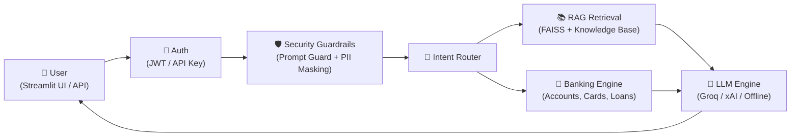
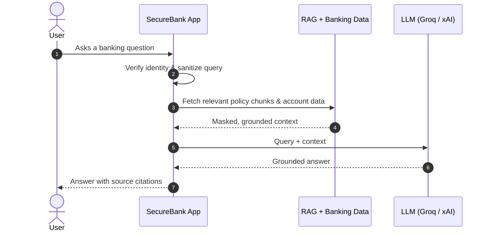

# 🏦 SecureBank RAG: AI-Powered Banking Assistant

SecureBank RAG is a production-grade, security-hardened banking assistant that combines a local **Retrieval-Augmented Generation (RAG)** knowledge base with live banking APIs and **Groq LPU** LLM inference to deliver instant, grounded, and citation-backed answers to customer banking queries. Built using **FastAPI**, **Streamlit**, HuggingFace **Sentence-Transformers**, and **FAISS / ChromaDB**, SecureBank RAG blends real account data, policy documents, and guarded prompt handling into a single conversational banking experience.

[](https://www.python.org/downloads/)
[](https://fastapi.tiangolo.com/)
[](https://streamlit.io/)
[](https://groq.com/)
[](https://github.com/facebookresearch/faiss)
[]()

---

## ✨ Features & Architecture

SecureBank RAG runs every request through a simple pipeline: **auth → security guardrails → intent routing → retrieval/banking data → LLM generation**.



### Request Flow



### 1. 🖥️ Frontend Layer (`frontend/`)
Streamlit single-page application delivering the full customer experience.
- **Login Screen**: Secure JWT login with demo profile switcher.
- **AI Chat Screen**: Conversational UI with quick-action chips, intent badges, citation chips, and developer debug drawers.
- **Account & Balance Screen**: Real-time balance cards, available credit, and branch metadata.
- **Transaction Ledger**: Paginated statements with debit/credit styling and instant internal fund transfers.
- **Cards Management**: Interactive card visualizer with freeze/unfreeze toggles, reward points, and limit controls.
- **Loan Catalog & Calculator**: Product cards with an interactive EMI repayment calculator.
- **Cheque Book Wizard**: Multi-step requisition workflow with address verification.

### 2. 🛡️ Security & Compliance Engine (`app/security/`)
- **Prompt Injection Defense** (`prompt_guard.py`): 19 compiled regex attack patterns detecting system prompt leakage, instruction resets, DAN jailbreaks, and SQL injection attempts. Returns a calculated `risk_score` (0–100) and sanitizes invisible control characters, auto-aborting high-risk prompts with `400 Bad Request`.
- **PII Data Masking** (`masking.py`): Automatically masks account numbers, credit/debit cards, IFSC codes, email addresses, and phone numbers before passing to the LLM or log output.
- **Authentication & Authorization** (`jwt_handler.py`, `password.py`, `users.py`): bcrypt password hashing (work factor: 12), JWT Bearer tokens (HS256) with short-lived access tokens (30 min) and refresh tokens (7 days), plus strict account-ownership enforcement.

### 3. 🎯 Intent Classification Subsystem (`app/intent/router.py`)
Two-stage router combining fast keyword matching with a semantic cosine-similarity fallback (`all-MiniLM-L6-v2`) across eight supported intents: `account_inquiry`, `balance_check`, `transaction_history`, `product_info`, `loan_inquiry`, `card_inquiry`, `fraud_alert`, and `general_banking`.

### 4. 🗄️ RAG Knowledge Pipeline (`app/rag/`)
- **Knowledge Base**: 10 bank policy documents covering accounts, loans, cards, dispute resolution, KYC, remittances, and digital banking terms.
- **Embedding Model**: Local HuggingFace `sentence-transformers/all-MiniLM-L6-v2` (384-dim normalized vectors).
- **Vector Search**: Pluggable backend — **FAISS** (IndexFlatIP) by default, or persistent **ChromaDB**.
- **Context Construction**: Dynamic chunk formatting with strict token budgeting and source citation attribution.

### 5. 🧠 Multi-Provider LLM Engine (`app/llm/grok_client.py`)
- **Groq Integration**: Native GroqCloud LPU inference via an OpenAI-compatible endpoint.
- **Smart Auto-Detection**: Keys beginning with `gsk_` bind to **Groq** (`qwen/qwen3.8-27b`); keys beginning with `xai-` route to **xAI Grok**.
- **Resilient Fallback**: Outages, rate limits, or invalid keys are caught automatically, falling back to a verified offline banking stub without crashing the service.

---

## 📁 Repository Structure

```bash
SecureBank_RAG/
├── app/
│   ├── security/              # Prompt guard, PII masking, JWT auth
│   │   ├── prompt_guard.py
│   │   ├── masking.py
│   │   ├── jwt_handler.py
│   │   ├── password.py
│   │   └── users.py
│   ├── intent/
│   │   └── router.py          # Two-stage intent classification
│   ├── rag/                   # Retrieval pipeline & vector store interface
│   ├── llm/
│   │   └── grok_client.py     # Multi-provider LLM engine (Groq / xAI / offline)
│   └── main.py                # FastAPI application entry point
├── data/
│   ├── knowledge_base/        # 10 banking policy markdown documents
│   └── faiss_index/           # Persisted FAISS vector index
├── frontend/                  # Streamlit SPA (chat, accounts, cards, loans)
├── tests/                     # 119-case unit, integration & security suite
│   ├── test_groq_llm.py
│   ├── test_security.py
│   └── test_rag.py
├── streamlit_app.py           # Streamlit frontend entry point
├── requirements.txt           # Python dependencies
├── docker-compose.yml         # Backend + frontend container orchestration
├── start.bat / stop.bat       # One-click Windows launch/stop scripts
└── README.md                  # Project documentation
```

---

## 🚀 Installation & Local Launch

Ensure you have **Python 3.12+** installed (Windows, macOS, or Linux).

### Option A: One-Click Launch (Windows)

```cmd
start.bat
```
- Launches both the **FastAPI Backend** (port 8000) and **Streamlit Frontend** (port 8501).
- Automatically opens your browser to [http://localhost:8501](http://localhost:8501).
- Run `stop.bat` to stop everything and free both ports.

### Option B: Manual Terminal Execution

1. **Clone the repository and set up a virtual environment:**
   ```bash
   git clone https://github.com/your-org/securebank-rag.git
   cd securebank-rag

   python -m venv .venv

   # Windows (PowerShell):
   .\.venv\Scripts\Activate.ps1
   # macOS/Linux:
   source .venv/bin/activate

   pip install -r requirements.txt
   ```

2. **Configure environment variables** — create a `.env` file in the root directory:
   ```ini
   # ── LLM (Groq via OpenAI-compatible API) ────────────────────
   GROQ_API_KEY=gsk_your_groq_api_key_here
   GROQ_MODEL=qwen/qwen3.8-27b
   GROQ_BASE_URL=https://api.groq.com/openai/v1

   # ── Embeddings & Vector Store ──────────────────────────────
   EMBEDDING_MODEL=all-MiniLM-L6-v2
   VECTOR_STORE_BACKEND=faiss
   FAISS_INDEX_PATH=./data/faiss_index
   TOP_K=5

   # ── Security & Authentication ──────────────────────────────
   API_KEY=securebank-dev-key-change-me
   JWT_SECRET_KEY=generate-a-random-64-character-hex-string
   JWT_ALGORITHM=HS256
   LOG_LEVEL=INFO

   # ── Frontend & Server ──────────────────────────────────────
   HOST=0.0.0.0
   PORT=8000
   API_BASE_URL=http://localhost:8000
   ```

3. **Run the stack** (in separate terminals):
   ```bash
   # Terminal 1: FastAPI Backend
   .venv\Scripts\python -m uvicorn app.main:app --host 0.0.0.0 --port 8000

   # Terminal 2: Streamlit Frontend
   .venv\Scripts\python -m streamlit run streamlit_app.py --server.port 8501
   ```

4. **Access the app:**
   - Streamlit Web UI → [http://localhost:8501](http://localhost:8501)
   - FastAPI Interactive Docs → [http://localhost:8000/docs](http://localhost:8000/docs)
   - Health Endpoint → [http://localhost:8000/health](http://localhost:8000/health)

---

## 🔑 API Reference

| Method | Endpoint | Auth | Description |
|---|---|---|---|
| `POST` | `/auth/login` | None | Authenticate with username & password; returns JWT access & refresh tokens |
| `POST` | `/auth/refresh` | None | Exchange a valid refresh token for a new access token |
| `GET` | `/auth/me` | JWT | Retrieve current user profile and assigned account ID |
| `POST` | `/auth/logout` | JWT | Terminate session |
| `POST` | `/chat/` | JWT or API Key | Main AI banking assistant endpoint with RAG and intent execution |
| `GET` | `/banking/accounts/{id}` | API Key | Retrieve full account details |
| `GET` | `/banking/accounts/{id}/balance` | API Key | Retrieve live and available balances |
| `GET` | `/banking/accounts/{id}/transactions` | API Key | Paginated transaction statement |
| `POST` | `/banking/transfer` | API Key | Transfer funds between accounts |
| `GET` | `/banking/loans` | API Key | Catalog of available loan products |
| `GET` | `/banking/cards/{id}` | API Key | Card details and limits |
| `POST` | `/ingest/` | API Key | Re-chunk and re-embed documents into FAISS |
| `GET` | `/ingest/status` | API Key | Check vector store document count |
| `GET` | `/health` | None | Server health, active vector backend, and LLM model |

---

## 👤 Demo Credentials

| Username | Password | Account ID | Role | Name |
|---|---|---|---|---|
| `alice` | `alice123` | `ACC001` | customer | Alice Johnson |
| `bob` | `bob123` | `ACC002` | customer | Bob Smith |
| `charlie` | `charlie123` | `ACC003` | customer | Charlie Brown |
| `dave` | `dave123` | `ACC004` | customer | Dave Wilson |
| `eve` | `eve123` | `ACC005` | customer | Eve Martinez |
| `admin` | `Admin@1234` | `ACC000` | admin | SecureBank Administrator |

---

## ✅ Verification & Testing

A comprehensive automated test suite (119 test cases) covers unit, integration, and security layers.

```bash
# Run the complete test suite
.venv\Scripts\python -m pytest tests/ -v

# Run only Groq LLM integration tests
.venv\Scripts\python -m pytest tests/test_groq_llm.py -v

# Run security and prompt guard tests
.venv\Scripts\python -m pytest tests/test_security.py -v

# Run RAG retriever & FAISS index tests
.venv\Scripts\python -m pytest tests/test_rag.py -v
```

---

## ☁️ Docker Deployment

Deploy the entire architecture with Docker Compose:

```bash
# Build and launch both Backend and Frontend containers
docker-compose up --build -d

# Check service logs
docker-compose logs -f
```

---

## 🛡️ License
Distributed under the MIT License. See `LICENSE` for more information.

---

### ❤️ A Friendly Note
Thank you for checking out SecureBank RAG! This project was built to demonstrate how a security-hardened RAG pipeline — prompt guarding, PII masking, intent routing, and multi-provider LLM fallback — can power a trustworthy conversational banking experience. If you have feedback or want to collaborate, feel free to reach out. Bank smart, stay secure!
