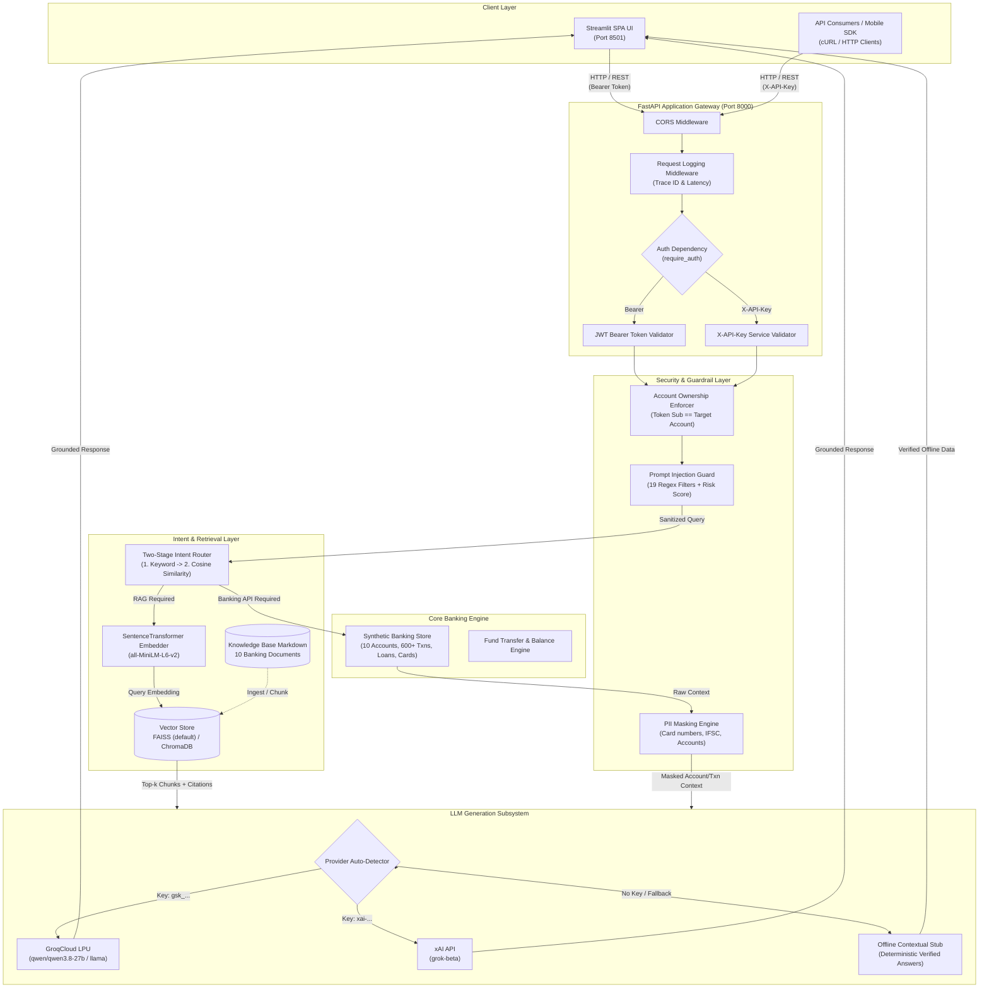
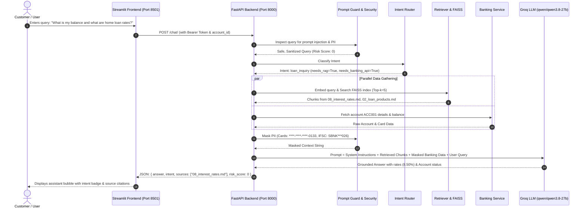

# SecureBank RAG — AI-Powered Banking Assistant

[](https://www.python.org/downloads/)
[](https://fastapi.tiangolo.com/)
[](https://streamlit.io/)
[](https://groq.com/)
[](https://github.com/facebookresearch/faiss)
[]()

A production-grade, security-hardened banking assistant built with **FastAPI**, **Streamlit**, **HuggingFace Sentence-Transformers**, **FAISS / ChromaDB**, and **Groq LPU** inference (with xAI Grok and offline stub fallback).

---

## 1. System Architecture

### High-Level Architecture Diagram



---

## 2. Request & RAG Data Flow



---

## 3. Core Subsystems

### 1. Frontend Layer (`frontend/`)
- **Technology**: Streamlit Single-Page Application (SPA)
- **Features**:
  - **Login Screen**: Secure JWT login with demo profile switcher.
  - **AI Chat Screen**: Interactive conversational UI with quick-action chips, intent badges, citation chips, and developer debug inspection drawers.
  - **Account & Balance Screen**: Real-time balance cards, available credit, and branch metadata.
  - **Transaction Ledger**: Paginated tabular statements with debit/credit styling and instant internal fund transfers.
  - **Cards Management**: Interactive card visualizer with freeze/unfreeze toggles, reward points, and limit controls.
  - **Loan Catalog & Calculator**: Detailed product cards with an interactive EMI monthly repayment calculator.
  - **Cheque Book Wizard**: Multi-step requisition workflow with address verification.

### 2. Security & Compliance Engine (`app/security/`)
- **Prompt Injection Defense (`prompt_guard.py`)**:
  - 19 compiled regex attack patterns detecting system prompt leakage, instruction resets, DAN jailbreaks, and SQL injection attempts.
  - Returns calculated `risk_score` (0–100) and sanitizes invisible control characters.
  - Automatically aborts with `400 Bad Request` on high-risk prompts.
- **PII Data Masking (`masking.py`)**:
  - Automatically masks account numbers (`****-****-****-1234`), credit/debit cards (`4111-****-****-1111`), IFSC codes (`SBNK***026`), email addresses, and phone numbers before passing to the LLM or log output.
- **Authentication & Authorization (`jwt_handler.py`, `password.py`, `users.py`)**:
  - Standard **bcrypt** password hashing (work factor: 12) with constant-time verification.
  - **JWT Bearer tokens** (HS256) with separate short-lived access tokens (30 mins) and refresh tokens (7 days).
  - **Account Ownership Enforcement**: Chat router enforces that JWT users can only access their authenticated `account_id`.

### 3. Intent Classification Subsystem (`app/intent/router.py`)
- **Stage 1 (Exact Keyword Matching)**: Rapid, deterministic identification based on curated domain lexicons.
- **Stage 2 (Semantic Cosine Embedding Fallback)**: Computes cosine similarity between the query embedding and pre-indexed intent description vectors via HuggingFace `all-MiniLM-L6-v2`.
- **Supported Intents**:
  - `account_inquiry` (Banking API + RAG)
  - `balance_check` (Banking API only)
  - `transaction_history` (Banking API only)
  - `product_info` (RAG only)
  - `loan_inquiry` (RAG + Banking API)
  - `card_inquiry` (RAG + Banking API)
  - `fraud_alert` (RAG + Banking API + Emergency Escalation Flag)
  - `general_banking` (RAG only)

### 4. RAG Knowledge Pipeline (`app/rag/`)
- **Knowledge Base**: 10 bank policy documents (`data/knowledge_base/*.md`) covering accounts, loans, cards, dispute resolution, KYC, international remittances, and digital banking terms.
- **Embedding Model**: Local HuggingFace `sentence-transformers/all-MiniLM-L6-v2` (384-dimensional normalized vectors).
- **Vector Search**: Pluggable backend supporting **FAISS** (IndexFlatIP for fast cosine inner product) or persistent **ChromaDB**.
- **Context Construction**: Dynamic document chunk formatting with strict token budgeting and source citation attribution.

### 5. Multi-Provider LLM Engine (`app/llm/grok_client.py`)
- **Groq Integration**: Native support for GroqCloud LPU inference via OpenAI-compatible endpoints (`https://api.groq.com/openai/v1`).
- **Smart Auto-Detection**:
  - Keys beginning with `gsk_` automatically bind to **Groq** using verified high-speed models (`qwen/qwen3.8-27b`).
  - Keys beginning with `xai-` route to **xAI Grok** (`https://api.x.ai/v1`).
- **Resilient Fallback**: If external LLM APIs experience outages, rate limits, or invalid keys, the engine automatically catches exceptions and responds using the verified offline banking stub without crashing the service.

---

## 4. API Reference

| Method | Endpoint | Auth | Description |
|---|---|---|---|
| `POST` | `/auth/login` | None | Authenticate with username & password; returns JWT access & refresh tokens |
| `POST` | `/auth/refresh` | None | Exchange valid refresh token for a new access token |
| `GET` | `/auth/me` | JWT | Retrieve current user profile and assigned account ID |
| `POST` | `/auth/logout` | JWT | Terminate session |
| `POST` | `/chat/` | JWT or API Key | Main AI banking assistant endpoint with RAG and intent execution |
| `GET` | `/banking/accounts/{id}` | API Key | Retrieve full account details |
| `GET` | `/banking/accounts/{id}/balance` | API Key | Retrieve live and available balances |
| `GET` | `/banking/accounts/{id}/transactions` | API Key | Paginated transaction statement |
| `POST` | `/banking/transfer` | API Key | Transfer funds between accounts |
| `GET` | `/banking/loans` | API Key | Catalog of available loan products |
| `GET` | `/banking/cards/{id}` | API Key | Card details and limits |
| `POST` | `/ingest/` | API Key | Re-chunk and re-embed documents into FAISS |
| `GET` | `/ingest/status` | API Key | Check vector store document count |
| `GET` | `/health` | None | Server health, active vector backend, and LLM model |

---

## 5. Quick Start Guide

### Option A: One-Click Launch (Easiest for Windows)

Double-click or run [`start.bat`](file:///C:/Users/novan/.gemini/antigravity/scratch/securebank-rag/start.bat):
```cmd
start.bat
```
- Launches both **FastAPI Backend** (port 8000) and **Streamlit Frontend** (port 8501).
- Automatically opens your browser to [http://localhost:8501](http://localhost:8501).
- To stop everything and free both ports, double-click [`stop.bat`](file:///C:/Users/novan/.gemini/antigravity/scratch/securebank-rag/stop.bat).

---

### Option B: Manual Terminal Execution

#### Prerequisites
- Python 3.12+ installed
- Windows, macOS, or Linux


### 1. Clone & Setup Virtual Environment
```bash
git clone https://github.com/your-org/securebank-rag.git
cd securebank-rag

# Create virtual environment
python -m venv .venv

# Activate environment
# Windows (PowerShell):
.\.venv\Scripts\Activate.ps1
# macOS/Linux:
source .venv/bin/activate

# Install dependencies
pip install -r requirements.txt
```

### 2. Environment Configuration
Create a `.env` file in the root directory:
```ini
# ── LLM (Groq via OpenAI-compatible API) ────────────────────
GROQ_API_KEY=gsk_your_groq_api_key_here
GROQ_MODEL=qwen/qwen3.8-27b
GROQ_BASE_URL=https://api.groq.com/openai/v1

# ── Embeddings & Vector Store ──────────────────────────────
EMBEDDING_MODEL=all-MiniLM-L6-v2
VECTOR_STORE_BACKEND=faiss
FAISS_INDEX_PATH=./data/faiss_index
TOP_K=5

# ── Security & Authentication ──────────────────────────────
API_KEY=securebank-dev-key-change-me
JWT_SECRET_KEY=generate-a-random-64-character-hex-string
JWT_ALGORITHM=HS256
LOG_LEVEL=INFO

# ── Frontend & Server ──────────────────────────────────────
HOST=0.0.0.0
PORT=8000
API_BASE_URL=http://localhost:8000
```

### 3. Run the Stack
Run the services in separate terminals:

```bash
# Terminal 1: FastAPI Backend
.venv\Scripts\python -m uvicorn app.main:app --host 0.0.0.0 --port 8000

# Terminal 2: Streamlit Frontend
.venv\Scripts\python -m streamlit run streamlit_app.py --server.port 8501
```

Access the applications:
- **Streamlit Web UI**: [http://localhost:8501](http://localhost:8501)
- **FastAPI Interactive Docs**: [http://localhost:8000/docs](http://localhost:8000/docs)
- **Health Endpoint**: [http://localhost:8000/health](http://localhost:8000/health)

---

## 6. Demo Credentials

| Username | Password | Account ID | Role | Name |
|---|---|---|---|---|
| `alice` | `alice123` | `ACC001` | customer | Alice Johnson |
| `bob` | `bob123` | `ACC002` | customer | Bob Smith |
| `charlie` | `charlie123` | `ACC003` | customer | Charlie Brown |
| `dave` | `dave123` | `ACC004` | customer | Dave Wilson |
| `eve` | `eve123` | `ACC005` | customer | Eve Martinez |
| `admin` | `Admin@1234` | `ACC000` | admin | SecureBank Administrator |

---

## 7. Verification & Testing

The project contains a comprehensive automated test suite (119 test cases) covering unit, integration, and security layers.

```bash
# Run the complete test suite
.venv\Scripts\python -m pytest tests/ -v

# Run only Groq LLM integration tests
.venv\Scripts\python -m pytest tests/test_groq_llm.py -v

# Run security and prompt guard tests
.venv\Scripts\python -m pytest tests/test_security.py -v

# Run RAG retriever & FAISS index tests
.venv\Scripts\python -m pytest tests/test_rag.py -v
```

---

## 8. Docker Deployment

Deploy the entire architecture with Docker Compose:

```bash
# Build and launch both Backend and Frontend containers
docker-compose up --build -d

# Check service logs
docker-compose logs -f
```